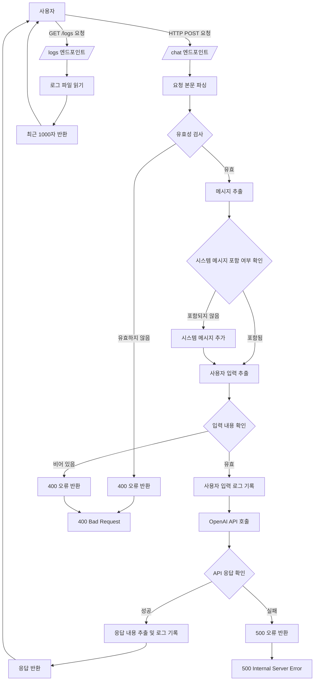

# PLKIT-AI.chat


## Table of Contents

- [Overview](#overview)
- [Project Structure](#project-structure)
- [Features](#features)
- [Getting Started](#getting-started)
  - [Dependencies](#dependencies)
  - [Installation](#installation)
  - [Configuration](#configuration)
- [Contributing](#contributing)
- [License](#license)

## Overview


PLKIT-AI.chat is a chatbot application that emulates a **Smart Farm Expert**. Built on FastAPI, this application leverages OpenAI's GPT-4 API to facilitate natural and engaging conversations with users. By setting up user personas, the chatbot provides professional responses tailored to specific fields. Additionally, it manages conversation logs for future analysis and monitoring. Designed for seamless deployment, PLKIT-AI.chat can be easily hosted on cloud services such as AWS EC2.

## Project Structure

```
PLKIT-AI.chat/
├── app.py # FastAPI application main file
├── set_persona.py # User persona setup and chatbot logic
├── set_connection.py # OpenAI API key configuration
├── requirements.txt # Project dependencies list
├── chatbot.log # Application log file
├── README.md # Project documentation
├── config.conf # configuration file
└── .gitignore # Git ignore file
```

## Features

- **User Persona Setup**: Define user personas with specific roles and backgrounds to ensure consistent and relevant conversation experiences.
- **OpenAI GPT-4 Integration**: Utilize the latest AI models to generate natural and contextually appropriate responses.
- **Log Management**: Save conversation logs to files for subsequent analysis and monitoring.
- **FastAPI-based API**: Provide a RESTful API that supports communication with various clients.
- **AWS Deployment Support**: Facilitate easy deployment on AWS EC2 and other AWS services with provided configurations.

`## Getting Started

This section outlines how to set up and run the project locally.

### Dependencies

The project relies on the following major dependencies:

- Python 3.9 or higher
- FastAPI
- Uvicorn
- OpenAI
- Pydantic
- Git

### Installation

1. **Clone the Repository**

   ```
   git clone https://github.com/yasaenghwa/PLKIT-AI.chat.git
   cd PLKIT-AI.chat`
   ```

2. **Set Up a Python Virtual Environment**
   `python3 -m venv venv`
   `source venv/bin/activate   # For Windows: venv\Scripts\activate`

3. **Install Dependencies**
   `pip install --upgrade pip`
   `pip install -r requirements.txt`

4. **Set Up Environment Variables**
   Configure the OpenAI API key as an environment variable. It is recommended to use a `.env` file for security.

   `export OPENAI_API_KEY='your-openai-api-key'   # For Unix/Linux
set OPENAI_API_KEY='your-openai-api-key'      # For Windows`

   Alternatively, create a `.env` file in the project root:
   `OPENAI_API_KEY=your-openai-api-key`

5. **Run the Application**
   `uvicorn app:app --host 0.0.0.0 --port 8000`

   Access the API documentation by navigating to `http://localhost:8000/docs` in your browser.

### Configuration

#### Environment Variables

- **`OPENAI_API_KEY`**: Set your OpenAI API key to enable GPT-4 integration. This key is essential for accessing OpenAI's services.

#### File Descriptions

- **`app.py`**: The main FastAPI application file that defines endpoints and application settings.
- **`set_persona.py`**: Defines user personas and handles the chatbot's response logic.
- **`set_connection.py`**: Contains functions to retrieve and manage the OpenAI API key.
- **`requirements.txt`**: Lists all Python packages required for the project.
- **`Dockerfile`**: Configuration file for building the Docker image of the application.
- **`chatbot.log`**: Log file where the application's runtime logs are stored.
- **`README.md`**: Documentation file for the project.
- **`.gitignore`**: Specifies files and directories that Git should ignore.

## Contributing

Contributions are welcome! Please follow these guidelines to contribute to the project:

1.  **Fork the Repository**

    Create a personal copy of the repository by forking it.

2.  **Create a Feature Branch**
    `git checkout -b feature/your-feature-name`

3.  **Commit Your Changes**
    `git commit -m "Add your message here"`

4.  **Push to the Branch**
    `git push origin feature/your-feature-name`

5.  **Create a Pull Request**

### Contribution Guidelines

- **Code Style**: Adhere to PEP 8 standards for Python code.
- **Testing**: Include tests for new features or bug fixes.
- **Documentation**: Update documentation to reflect changes made in your contributions.

## License

This project is licensed under the MIT License.

© 2024 PLKIT-AI.chat. All rights reserved.
